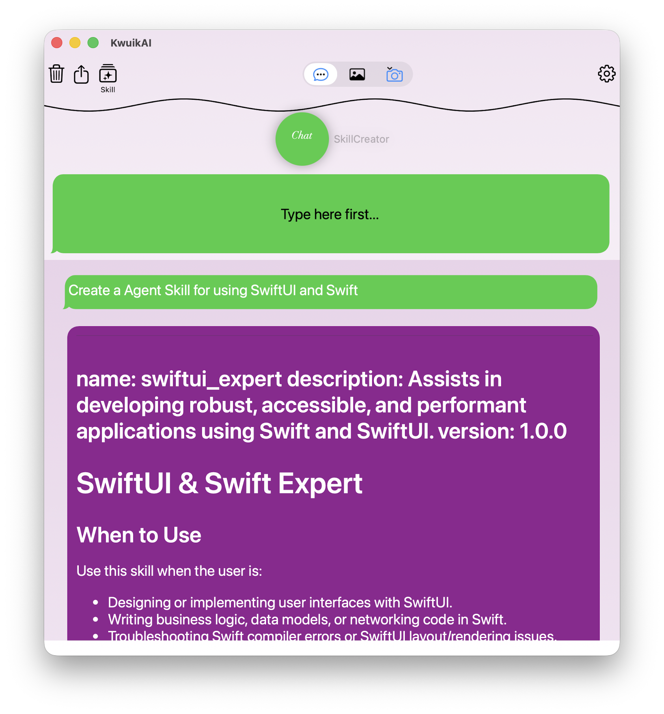
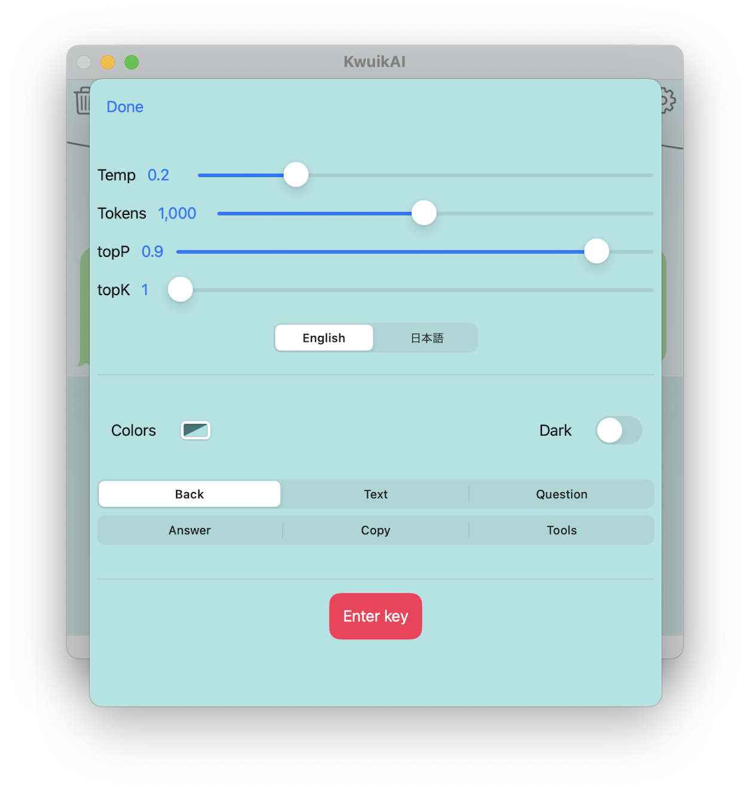

# SwiftUI Google Gemini AI demo App

A chat-like SwiftUI Google Gemini REST API demo App, includes text and image input, no image output.

Using the Swift [GeminiKitAPI](https://github.com/workingDog/GeminiKitAPI) library, which is a cutdown version of the original code [GeminiKit](https://github.com/guitaripod/GeminiKit) library, 
"A comprehensive Swift SDK for the Google Gemini API with full feature coverage and a powerful CLI".

  
    

### Usage

-   **Pick the conversation mode first**, *Chat*, *Image* or *Camera*, 
then type a question **before** you tap on the main button.

    - *Chat* for chat like interaction,
    - *Image* for selecting one or more images from the Photos library,
    - *Camera* to take one picture using the camera.
    
-   **Tap on a question or answer text**, to **copy** the text to the *Pasteboard* and enable you to paste it elsewhere or *share* it. Similarly, tap on the picture to copy just the image.
  
-   **Swipe left** on a question/answer, to deleted it.
  
-   **Tap on the trash can**, to delete **all** questions and answers. 

-   **Tap on the share**, to share the previously tapped text or picture. 

-   **Tap on the skill** button, to add/delete/modify skills in YAML frontmatter followed by Markdown content. The selected *skill* is then used in the call to the AI. In addition, a search for **skills** in [Skyll](https://www.skyll.app/) can be made using a natural languge query.

#### Settings

Press the **gear shape** icon to:

-   enter the **required** api key,
-   select the model parameters,
-   select the UI colors,
-   select the UI language

Note, the [Google AI key](https://ai.google.dev/) is stored securely on the device keychain.

  
### References and dependencies

#### Skills

-    [Agent Skills](https://agentskills.io/home)
-    [Agent Skills github](https://github.com/agentskills/agentskills)
-    [Swift Agent Skills](https://github.com/twostraws/Swift-Agent-Skills)
-    [Gemini API skills](https://github.com/google-gemini/gemini-skills)
-    [Skyll](https://www.skyll.app/)

#### Dependencies

-    [GeminiKitAPI](https://github.com/workingDog/GeminiKitAPI) derived from the original repo [GeminiKit](https://github.com/guitaripod/GeminiKit)
-    [MarkdownUI](https://github.com/gonzalezreal/swift-markdown-ui)
-   [SwiftSkyllKit](https://github.com/workingDog/SwiftSkyllKit)

See also

-    [GeminiKit docs](https://guitaripod.github.io/GeminiKit/documentation/geminikit)

### Requirement

**Requires** a valid API key, see:

-    [Google AI for developers](https://ai.google.dev/)

Copy and paste the key into the **Settings** ("gear shape") and save it in the *Enter key* area.

### License

The MIT License (MIT)
