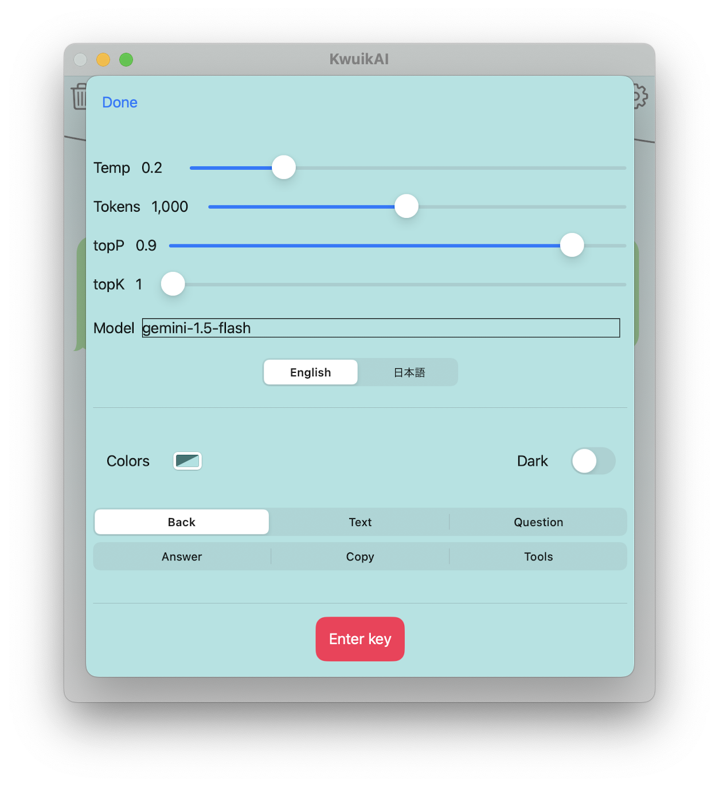

# SwiftUI Google Gemini AI demo App

A chat-like SwiftUI Google Gemini REST API demo App, includes text and image input, no image output.

Using the Swift [GeminiKit](https://github.com/guitaripod/GeminiKit) library, 
"A comprehensive Swift SDK for the Google Gemini API with full feature coverage and a powerful CLI".

  
    

### Usage

-   **Pick** the conversation mode first, `Chat`, `Image` or `Camera`, 
then type a question **before** you tap on the main button.

    - `Chat` for chat like interaction,
    - `Image` for selecting one or more images from the Photos library,
    - `Camera` to take one picture using the camera.
    
-   **Tap** on a question or answer text, to **copy** the text to the `Pasteboard` and enable you to paste it elsewhere or `share` it. Similarly, tap on the picture to copy just the image.
  
-   **Swipe left** on a question/answer, to deleted it.
  
-   **Tap** on the `trash can`, to delete **all** questions and answers. 

-   **Tap** on the `share`, to share the previously tapped text or picture. 

#### Settings

Press the **gear shape** icon to:

-   enter the **required** api key,
-   select the model parameters,
-   select the UI colors,
-   select the UI language

Note, the [Google AI key](https://ai.google.dev/) is stored securely on the device keychain.

  
### References and dependencies

-    [GeminiKit](https://github.com/guitaripod/GeminiKit)
-    [GeminiKit docs](https://guitaripod.github.io/GeminiKit/documentation/geminikit)
-    [MarkdownUI](https://github.com/gonzalezreal/swift-markdown-ui)

### Requirement

**Requires** a valid API key, see:

-    [Google AI for developers](https://ai.google.dev/)

Copy and paste the key into the **Settings** ("gear shape") and save it in the `Enter key` area.

### License

The MIT License (MIT)
